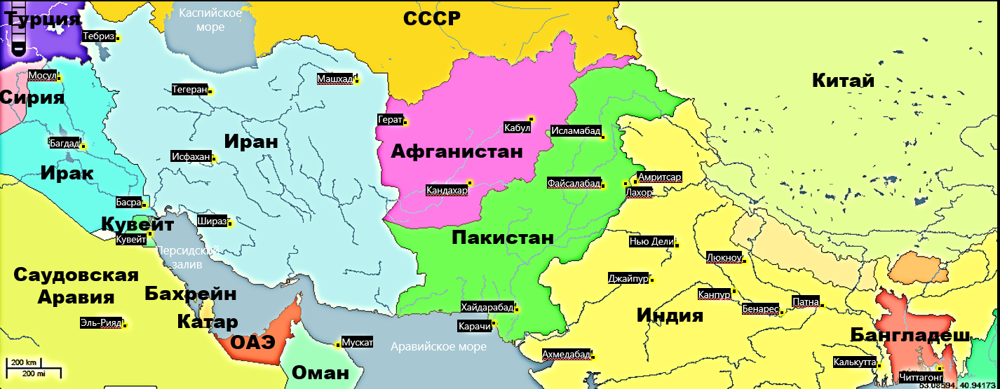

### Афганистан в конце 1970-х гг
## Революция в Афганистане :

- Событие: В 1978 году произошла САУР (апрельская) революция, которая свергла монархию и установила режим народной демократии.

- Силы: У власти пришли просоветские коммунисты во главе с Народно-демократической партией Афганистана (НДПА).

- Реформа: Новые власти начали осуществлять агрессивные реформы, направленные на социализацию, что вызвало недовольство среди населения.

### горячая точка в Афганистане :

- Конфликт: Афганистан стал одним из главных фронтов холодной войны, где столкнулись интересы СССР и США. 

- Моджахеды: Восстание моджахедов против советского присутствия получило широкую поддержку со стороны США, Пакистана и других стран.

- Военные действия: С обеих сторон велись активные боевые действия, что сделало страну одной из самых опасных и конфликтных зон в мире.

- Гуманитарные последствия: Война вызвала массовые миграции населения, разрушение инфраструктуры и тяжелые гуманитарные кризисы, которые продолжают оказывать влияние на Афганистан и соседние страны. 

Таким образом, конец 1970-х годов стал переломным моментом в истории Афганистана, 
когда страна оказалась втянутой в длительный конфликт с участием международных сил.

### шутка :

Почему в Афганистане в конце 1970-х перестали играть в прятки?

Потому что все уже знали, кто прячется за каждым углом! 😄