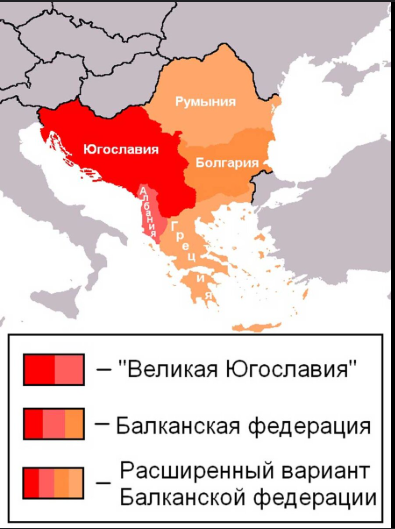
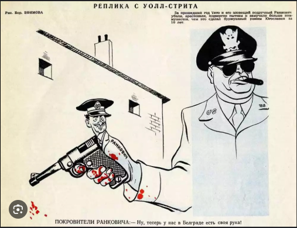
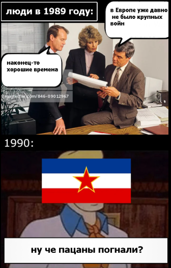

### Название: Урегулирование отношений с Югославией (1950-1955)

### Подзаголовок: Исторический обзор дипломатических и политических процессов

# Введение

Процесс урегулирования отношений между Советским Союзом и Федеративной Народной Республикой Югославия (ФНРЮ) в период с 1950 по 1955 год был сложным и многослойным. Он включал в себя ряд ключевых моментов, которые привели к восстановлению дипломатических и экономических связей между двумя странами после их разрыва в конце 1940-х годов.

Основные этапы урегулирования:

1. Причины конфликта (до 1950 года):
После окончания Второй мировой войны в Югославии установился режим под руководством Иосипа Броз Тито, который стремился проводить независимую от Москвы политику. Это вызвало недовольство со стороны Иосифа Сталина, что привело к разрыву отношений между СССР и ФНРЮ в 1948 году.

2. Первые попытки сближения (1950–1953 годы):
Смерть Сталина в марте 1953 года открыла возможности для пересмотра внешней политики Советского Союза. Новый советский лидер Никита Хрущёв начал процесс десталинизации, включая изменение подхода к отношениям с другими социалистическими странами.
В этот период начались первые неофициальные контакты между представителями двух государств, но существенных изменений не произошло.

3. Активизация диалога (1954 год):
В мае 1954 года делегация СССР во главе с Анастасом Микояном посетила Белград. Эти переговоры стали первым официальным шагом к нормализации отношений.
Были достигнуты предварительные договоренности о возобновлении экономического сотрудничества и обмене делегациями.

4. Визит Хрущёва в Югославию (май 1955 года):
Кульминацией процесса урегулирования стал визит Никиты Хрущёва в Белград в мае 1955 года. Во время этого визита были подписаны важные декларации и соглашения, закрепляющие восстановление дружественных отношений.
Одним из главных результатов стало признание права каждой страны на свой собственный путь построения социализма, что позволило Югославии сохранить свою независимость в рамках социалистической системы.

5. Последствия нормализации:
Восстановление дипломатических и экономических связей способствовало укреплению стабильности в Восточной Европе.
Улучшились условия для культурного обмена и научного сотрудничества между СССР и ФНРЮ.
Нормализация отношений продемонстрировала возможность мирного решения международных споров через переговоры и компромисс.
Этот процесс урегулирования имел важное значение не только для двусторонних отношений, но и для общей международной обстановки того времени.

История урегулирования отношений с Югославией

### Предпосылки конфликта

1. Политика Иосипа Броз Тито:
После окончания Второй мировой войны Иосип Броз Тито возглавил Коммунистическую партию Югославии и установил в стране режим, ориентированный на построение социализма. Однако его политика отличалась значительной степенью независимости от Москвы, что вызывало недовольство у советского руководства.

2. Разногласия по вопросам экономической и военной интеграции:
Сталин настаивал на том, чтобы все социалистические страны следовали единой линии в вопросах экономики и обороны, что подразумевало тесную координацию с Москвой. Тито же стремился развивать экономику Югославии самостоятельно, без прямого вмешательства СССР.

3. Национальная гордость и стремление к суверенитету:
Югославские коммунисты считали, что они добились победы над фашизмом своими силами, и поэтому имели право на самостоятельность в принятии решений. Это противоречило представлениям Сталина о роли СССР как лидера мирового коммунистического движения.

4. Идеологические расхождения:
Хотя обе страны провозглашали приверженность марксизму-ленинизму, их подходы к реализации этих идей существенно различались. Тито считал возможным сочетание социалистических принципов с элементами рыночной экономики, что шло вразрез с ортодоксальной советской моделью.

5. Конфликт вокруг Албании:
Один из конкретных эпизодов, обостривших отношения, связан с попытками Югославии установить контроль над Албанией. Сталин видел в этом угрозу своим интересам в регионе и воспринял действия Тито как вызов своему авторитету.

6. Отказ от участия в Коминформе:
В 1947 году была создана Информационное бюро коммунистических и рабочих партий (Коминформ), целью которого было координация действий коммунистических партий различных стран. Югославия отказалась участвовать в этой организации, что еще больше усугубило напряженность с СССР.

### Международное вмешательство

1. Изменение внешнеполитической стратегии США:
После окончания Второй мировой войны Соединенные Штаты начали активно поддерживать антикоммунистические силы в Европе, стремясь ограничить влияние СССР. В случае с Югославией это означало поддержку Тито в его стремлении к независимости от Москвы. Американская помощь позволила Югославии укрепить свои позиции и продолжить курс на самостоятельное развитие.

2. Роль Организации Объединенных Наций (ООН):
ООН сыграла роль посредника в некоторых аспектах урегулирования отношений между СССР и Югославией. Организация предоставляла платформу для обсуждения спорных вопросов и поиска компромиссных решений. В частности, ООН участвовала в переговорах по вопросу о границе между Югославией и Италией, что помогло снизить напряженность в регионе.

3. Влияние других социалистических стран:
Некоторые страны Восточного блока, такие как Польша и Чехословакия, также оказывали давление на СССР с целью нормализации отношений с Югославией. Они видели в этом шаге возможность укрепления единства социалистического лагеря и предотвращения новых конфликтов внутри него.

4. Участие международных организаций и форумов:
Международные форумы, такие как Совещание министров иностранных дел европейских стран, играли роль площадки для обсуждения вопросов, связанных с урегулированием отношений между СССР и Югославией. Эти мероприятия позволяли сторонам выражать свои позиции и искать пути к взаимопониманию.

5. Экономическая поддержка Запада:
Западные страны, включая США и Великобританию, предоставляли экономическую помощь Югославии, что помогало ей сохранять независимость от СССР. Эта поддержка укрепляла позиции Тито и давала ему возможность вести более независимую политику.

6. Миротворческие инициативы ООН:
ООН принимала участие в ряде мирных инициатив, направленных на снижение напряженности в регионе. Например, организация содействовала проведению переговоров по урегулированию территориальных споров между Югославией и ее соседями, что способствовало улучшению общей ситуации в регионе.

### Заключение

Процесс урегулирования отношений между СССР и Югославией в период с 1950 по 1955 годы был результатом сложного взаимодействия множества факторов, включая внутренние политические изменения в обоих странах, международные тенденции и личное взаимодействие лидеров.

Смерть Сталина и начало десталинизации открыли новые возможности для пересмотра внешней политики Советского Союза, что позволило начать процесс нормализации отношений с Югославией. Важными этапами этого процесса стали официальные визиты делегаций и заключение ряда соглашений, направленных на улучшение экономических и культурных связей.

Нормализация отношений имела значительное значение не только для самих стран, но и для всей Европы, поскольку она способствовала снижению напряженности в регионе и созданию условий для более стабильного развития. Опыт урегулирования отношений между СССР и Югославией также показывает важность гибкости и готовности к компромиссам при решении международных конфликтов.

Этот исторический опыт остается актуальным и сегодня, когда многие страны сталкиваются с аналогичными проблемами в своих отношениях. Изучение данного периода позволяет глубже понять механизмы международных отношений и найти способы эффективного урегулирования конфликтов в современном мире.