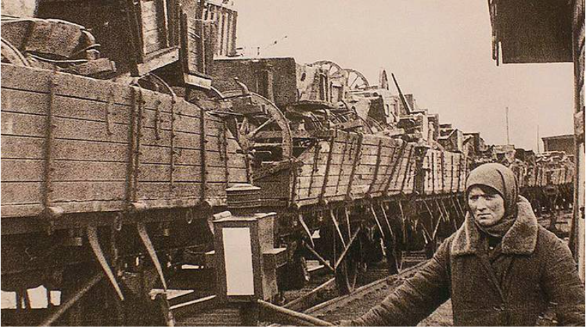
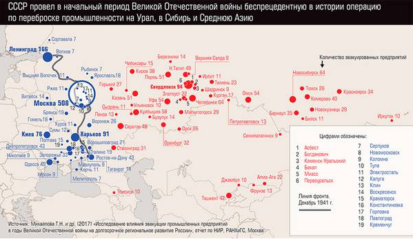
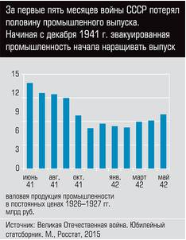
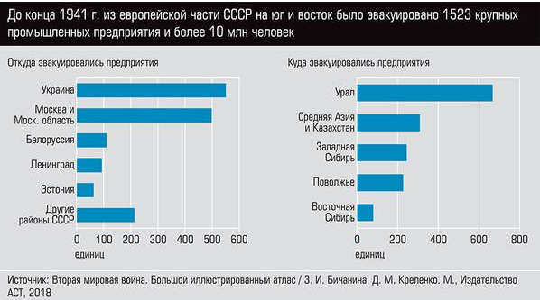

### Доклад о процессе эвокации 23 марта 1941 года

В условиях нарастающей угрозы со стороны нацистской Германии в 1941 году, Советский Союз предпринял ряд мер для подготовки к возможному военному конфликту. Одной из ключевых инициатив, принятых в это время, стала эвокация производственных мощностей и населения. 23 марта 1941 года в стране начался активный процесс, ставший важным этапом в обеспечении стратегической безопасности и экономической устойчивости.
Совет по эвакуации при СНК СССР — государственный орган, осуществлявший в начале Великой Отечественной войны оперативное руководство эвакуацией населения, учреждений, военных грузов и промышленных предприятий из местностей, находящихся под угрозой занятия германскими войсками. 
Создан 24 июня 1941 года совместным постановлением СНК СССР и ЦК ВКП(б). 
Совет обладал широкими полномочиями, его решения обязаны были выполнять все партийные и государственные органы.
Совет разрабатывал планы эвакуации людских контингентов и промышленных предприятий из прифронтовой полосы с указанием пунктов размещения, сроков, порядка и очерёдности эвакуации, организовывал обслуживание эвакуированных в пути, контролировал её прохождение. 

### Исторический контекст

На момент начала эвокации обстановка в Европе была крайне напряжённой. Германия уже оккупировала значительную часть Польши и готовила наступление на Советский Союз. Советское руководство понимало, что войны избежать не удастся, и начало подготовку к возможной агрессии. Это включало не только мобилизацию армии, но и защиту экономики через эвокацию стратегически важных объектов.

### Участники процесса эвокации

1. Николай Шверник:

   Николай Шверник, занимая пост председателя Президиума Верховного Совета СССР, играл крайне важную роль в организации эвакуации. Он выступал за скорейшую эвакуацию граждан на восток, где находились более безопасные территории. Его усилия были направлены на разработку законодательства, которое способствовало бы быстрой и эффективной организации процессов.

2. Алексей Косыгин:

   Алексей Косыгин выступал в качестве заместителя председателя Совета Министров и координировал деятельность по эвакуации промышленных предприятий. Он организовал транспортировку производственных мощностей на восток страны, что позволяло минимизировать потери и сохранить рабочие места. Его опыт и деловая хватка стали решающими в переориентации восточных регионов на возрастание производственной мощности.

3. Михаил Первухин:

   Министр тяжелой промышленности Михаил Первухин был ответственным за организацию переноса заводов и фабрик. Он активно взаимодействовал с руководителями предприятий и работниками, обеспечивая своевременное перемещение оборудования. Первухин внедрил новые методы работы, направленные на снижение затрат и ускорение процесса эвокации.

### Процесс эвокации

Процесс эвокации был многоступенчатым и охватывал множество аспектов:

- Перемещение заводов и фабрик: Промышленные объекты, расположенные в зонах возможной оккупации, были срочно перенесены в восточные регионы, такие как Урал и Сибирь. Это требовало не только физического перемещения оборудования, но и обучения рабочих на новых местах.

- Организация транспортировки рабочих и их семей: Порядка 20 миллионов людей было перемещено в условиях нехватки ресурсов и организационных проблем. Это требовало разработать планы по транспортировке поездов, автотранспорта и планирования новых мест проживания.

- Обеспечение сохранности оборудования и материалов: Оборудование, которое оставалось в западных регионах, зачастую подвергалось вооруженным атакам. Для предотвращения потерь разработали систему охраны перемещаемых объектов, а также контролировали сохранность запасов сырья.

### Заключение

Эвокация, начавшаяся 23 марта 1941 года, стала залогом дальнейшего экономического выживания Советского Союза в условиях войны. Участие Николая Шверника, Алексея Косыгина и Михаила Первухина в этом процессе обозначило важность управления и координации. Благодаря их усилиям, значительная часть промышленного потенциала была сохранена и использована для нужд фронта. Это не только помогло удержать экономику страны, но и стало важным фактором в дальнейшем противостоянии нацистским войскам.
